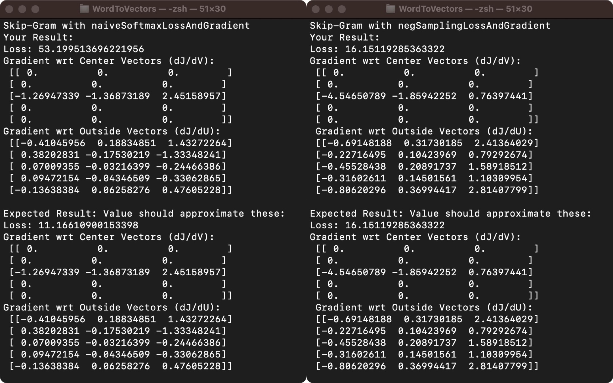
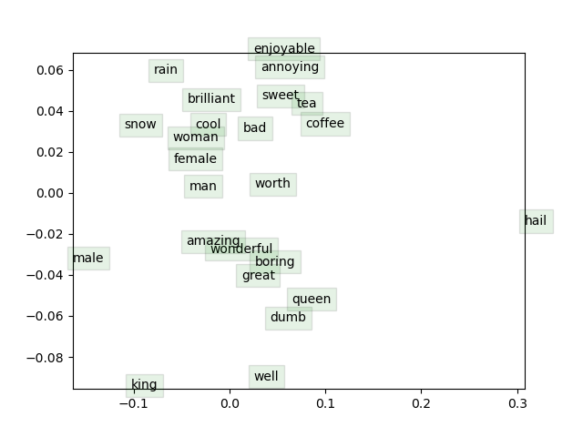

# WordToVectors

## TODO 1 Sigmoid

```py
    s = 1 / (1 + np.exp(-x))
```

## TODO 2 loss

```py
    score = np.exp(np.dot(outsideVectors, centerWordVec))
    y_hat = score / np.sum(np.exp(np.matmul(outsideVectors, centerWordVec)))
    loss = -np.sum(np.log(y_hat))
```

## TODO 3 gradient

```py
    gradCenterVec = np.matmul(outsideVectors.T, y_hat - y)
    gradOutsideVecs = np.matmul(np.matrix(y_hat - y).T, np.matrix(centerWordVec))
```

这次实验比较烧脑的并不是推公式，而是这几个矩阵用numpy是如何表示的。比如：

1. 习惯上向量是是列向量，但numpy默认是行向量
2. 单行array的转置，应该先把array转变成matrix（或者用reshape函数）
3. 注意.dot和.matmul矩阵乘法的区别

<div STYLE="page-break-after: always;"></div>

## 运行结果




## 对词向量的认识

1. 词向量最重要的意义是将人类能看懂的文字转换成计算机能计算的数据
2. word2vec就是找出文本在字典中的编号，乘以一个参数矩阵，得到一个长度为n的向量
3. 因为大量语料中相似词有相似的上下文，所以会得到相似的向量
4. skip-gram: 给定句子中的当前词，预测周围的词

## 实验生成图片的理解

一些单词出现了聚拢的现象，说明这些词向量在我们的语料库中共同出现的次数较多，在词性、含义、用法上有相似之处
